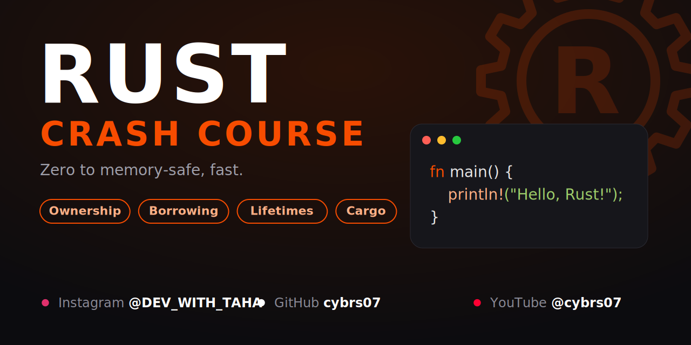

<p align="center">
  
</p>

# 🦀 Rust Crash Course

A hands-on, beginner-friendly crash course on Rust. Each topic lives in its own folder with runnable code and notes.

---

## 📋 Table of Contents

- [🦀 Rust Crash Course](#-rust-crash-course)
  - [📋 Table of Contents](#-table-of-contents)
  - [⚙️ Setup](#️-setup)
    - [1. Install Rust](#1-install-rust)
    - [2. Verify the installation](#2-verify-the-installation)
    - [3. Set up your editor (optional but recommended)](#3-set-up-your-editor-optional-but-recommended)
    - [4. Clone this repository](#4-clone-this-repository)
  - [▶️ Running Rust Files](#️-running-rust-files)
    - [Method 1: Using `rustc`](#method-1-using-rustc)
    - [Method 2: Using Cargo (recommended)](#method-2-using-cargo-recommended)
  - [📂 Project Structure](#-project-structure)
  - [🌐 Connect with Me](#-connect-with-me)

---

## ⚙️ Setup

### 1. Install Rust

Install Rust using [rustup](https://rustup.rs/), the official installer and version manager.

**Linux / macOS**
```bash
curl --proto '=https' --tlsv1.2 -sSf https://sh.rustup.rs | sh
```

**Windows**

Download and run `rustup-init.exe` from [rustup.rs](https://rustup.rs/).

### 2. Verify the installation

Restart your terminal, then run:
```bash
rustc --version
cargo --version
```

Both commands should print a version number.

### 3. Set up your editor (optional but recommended)

- Install [VS Code](https://code.visualstudio.com/)
- Add the **rust-analyzer** extension for autocomplete, error hints, and run buttons

### 4. Clone this repository

```bash
git clone https://github.com/cybrs07/Rust_crash_course.git
cd Rust_crash_course
```

---

## ▶️ Running Rust Files

### Method 1: Using `rustc`

1. Create a file and give it the `.rs` extension, for example `main.rs`.
2. Compile it first:
   ```bash
   rustc <filename>.rs
   ```
3. Run the compiled program:
   ```bash
   ./<filename>          # Linux / macOS
   <filename>.exe        # Windows
   ```

**Example**
```bash
rustc main.rs
./main
```

### Method 2: Using Cargo (recommended)

Cargo is Rust's build tool and package manager. It sets up the project structure for you and handles compiling and running automatically.

**Create a new project in a new folder**
```bash
cargo new <foldername>
```

**Create a project inside an already existing folder**
```bash
cd <existing-folder>
cargo init
```

**Compile and run (shows the output automatically)**
```bash
cargo run
```

**Other useful Cargo commands**

| Command | What it does |
|---|---|
| `cargo run` | Compile and run the project |
| `cargo build` | Compile only |
| `cargo check` | Check for errors quickly without producing a binary |
| `cargo build --release` | Compile with optimizations |

> 💡 A Cargo project looks like this:
> ```
> my_project/
> ├── Cargo.toml     # project config & dependencies
> ├── Cargo.lock     # exact dependency versions
> └── src/
>     └── main.rs    # entry point
> ```

---

## 📂 Project Structure

Click a topic to jump straight to its folder.

| Topic | Folder | Description |
|---|---|---|
| 👋 Hello World | [`hello`](./hello) | Your first Rust program |
| 🔢 Data Types | [`Datatypes`](./Datatypes) | Scalar types: integers, floats, booleans, and characters |
| 📦 Compound Data Types | [`Compound_Datatypes`](./Compound_Datatypes) | Tuples and arrays (Cargo project) |

```
Rust_crash_course/
├── hello/
├── Datatypes/
├── Compound_Datatypes/
│   ├── src/
│   │   └── main.rs
│   ├── Cargo.toml
│   └── readme.md
├── .gitignore
├── readme.md
└── rust-github-banner.png
```

---

## 🌐 Connect with Me

| Platform | Handle |
|---|---|
| 📸 Instagram | [@DEV_WITH_TAHA](https://instagram.com/DEV_WITH_TAHA) |
| 💻 GitHub | [cybrs07](https://github.com/cybrs07) |
| ▶️ YouTube | [@cybrs07](https://youtube.com/@cybrs07) |

⭐ If this course helps you, consider giving the repo a star!